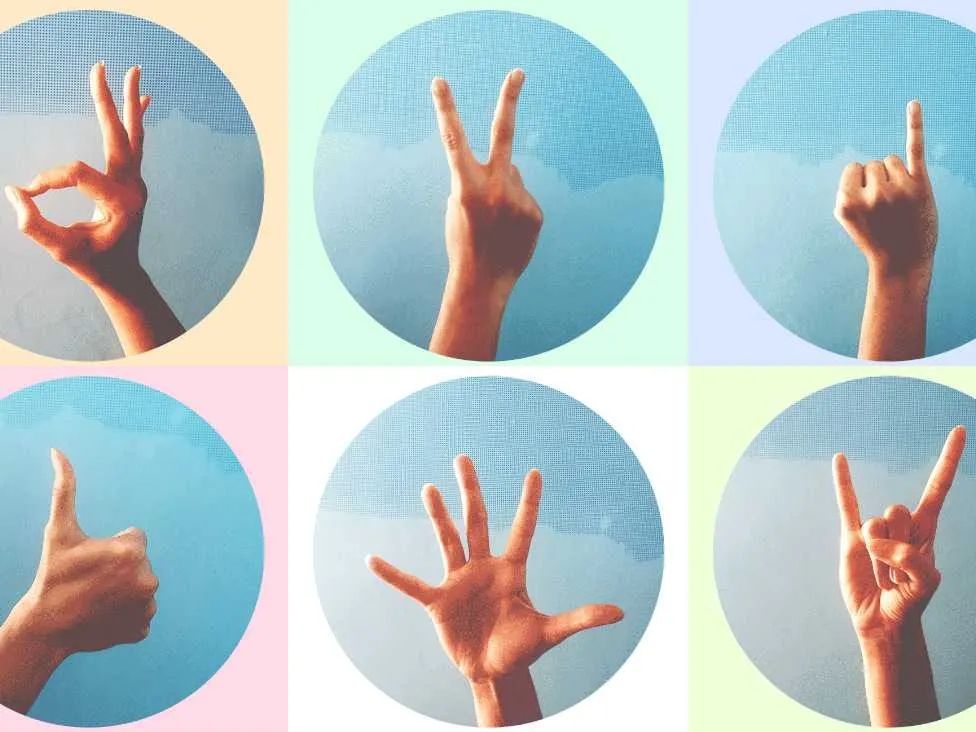
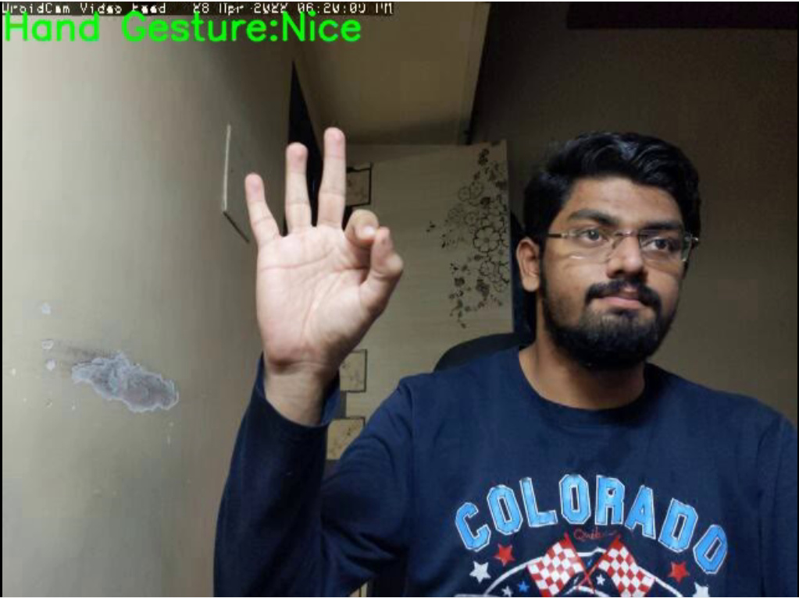

[](#read-me-template)
# Classification of Hand Gesture Using Python



> Where There Is Python There Is A Way 😜

---

## **Table of Contents**
<!-- You're sections headers will be used to reference location of destination. -->

- [Description](#description)
- [How To Use](#how-to-use)
- [References](#references)
- [License](#license)
- [Author Info](#author-info)

---

## **Description**

This projects helps in classification of Hand Gestures using OpenCV.

<font size="4"> **Use cases of this project**</font>

Gestures play an important role in our everyday communication and expression. Thus using them to communicate with tech devices needs very little intellectual data processing from our side. That means we can control different things such as vending machines almost without thinking, just by using our fingers and hands

Times have changed and so did the customer preferences. Nowadays, more and more people don't want to use touchscreens. Many of us think it's unhygienic to use a touchscreen of a public device such as an informational table, especially in times of the pandemic.


#### **Technologies**

- Python
- MediaPipe
- OpenCV


[Back To The Top](#read-me-template)

---

## **How To Use**

#### **Main Installation**

```html
    > git clone https://github.com/ReTrO19/Classify-Hand-Gesture-Python.git
    > cd Classify-Hand-Gesture-Python
    > python -m venv gesture_dect_venv
    > gesture_dect_venv\Scripts\activate
    > pip install -r requirements.txt
```

#### **How to run the inference**
```html
    > RunApp.bat
```
---
## **Outputs**
#### ( Model is trained on 2 class Nice and Peace )
#### **Detected Class: Nice**

#### **Detected Class: Peace**


[Back To The Top](#read-me-template)

---

## References

MediaPipe offers cross-platform, customizable ML solutions for live and streaming media.
[MediaPipe](https://google.github.io/mediapipe/solutions/hands.html)

[Back To The Top](#read-me-template)

---

## License

MIT License

Copyright (c) [2021] [Abhishek Khamkar]

Permission is hereby granted, free of charge, to any person obtaining a copy
of this software and associated documentation files (the "Software"), to deal
in the Software without restriction, including without limitation the rights
to use, copy, modify, merge, publish, distribute, sublicense, and/or sell
copies of the Software, and to permit persons to whom the Software is
furnished to do so, subject to the following conditions:

The above copyright notice and this permission notice shall be included in all
copies or substantial portions of the Software.

THE SOFTWARE IS PROVIDED "AS IS", WITHOUT WARRANTY OF ANY KIND, EXPRESS OR
IMPLIED, INCLUDING BUT NOT LIMITED TO THE WARRANTIES OF MERCHANTABILITY,
FITNESS FOR A PARTICULAR PURPOSE AND NONINFRINGEMENT. IN NO EVENT SHALL THE
AUTHORS OR COPYRIGHT HOLDERS BE LIABLE FOR ANY CLAIM, DAMAGES OR OTHER
LIABILITY, WHETHER IN AN ACTION OF CONTRACT, TORT OR OTHERWISE, ARISING FROM,
OUT OF OR IN CONNECTION WITH THE SOFTWARE OR THE USE OR OTHER DEALINGS IN THE
SOFTWARE.

[Back To The Top](#read-me-template)

---

## Author Info

- LinkedIn - [Abhishek Khamkar](https://www.linkedin.com/in/abhishek-khamkar-b30756185)


[Back To The Top](#read-me-template)
